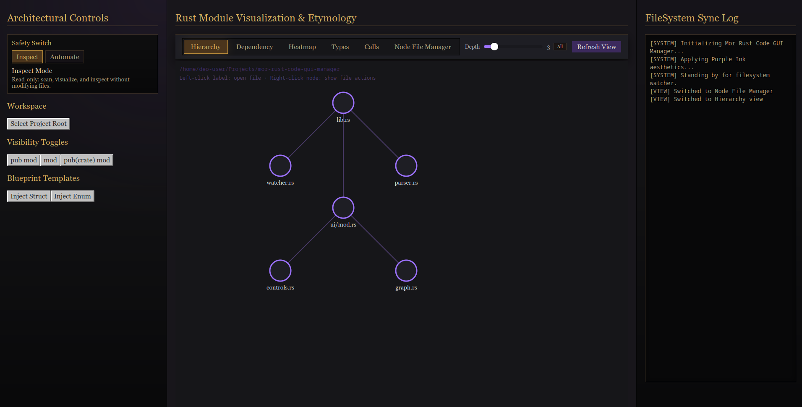

# Mor Rust Code GUI Manager

A Dioxus-powered Rust desktop GUI for exploring, visualizing, inspecting, and safely automating Rust project structure.

## Overview

Mor Rust Code GUI Manager is designed to help you understand a Rust codebase through visual graph modes, file-aware tooling, and guarded automation workflows.

It is built around a simple principle:

> See broadly. Modify carefully.

## Screenshot



## Features

### Visualization Modes
- **Hierarchy View** — inspect project/module structure as a graph.
- **Dependency View** — inspect relationships between project parts.
- **Heatmap View** — surface complexity or architectural pressure points.
- **Types View** — focus on structs, enums, and type-heavy files.
- **Calls View** — inspect call-oriented structure.
- **Node File Manager** — browse files and folders as interactive graph nodes.

### Safety Model
- **Inspect Mode** — read-only exploration.
- **Automate Mode** — guarded file modification after explicit preview/apply steps.

### File-Aware Tools
- Right-click node actions
- File and folder inspection
- Context-aware previews
- Planned automation tooling for Rust project maintenance

## Tech Stack

- **Rust**
- **Dioxus** (desktop UI)
- Common crates used in the project include:
  - `notify`
  - `syn`
  - `quote`
  - `anyhow`
  - `tokio`
  - `rfd`
  - `futures-util`

## Project Structure

```text
.
├── assets/
│   ├── purple_ink.css
│   └── css/
├── docs/
│   └── screenshots/
├── scripts/
├── src/
├── Cargo.toml
└── README.md
```
Running the App

From the project root:
```
cargo run --bin gui
```
CSS Workflow

The app uses split CSS files for easier maintenance, but Dioxus loads a bundled stylesheet from:

assets/purple_ink.css

Editable source CSS files live in:

assets/css/
Rebuild the bundled CSS

Run this from the project root:
```
./scripts/build-css.sh
Rebuild CSS and run the app
./scripts/build-css.sh
cargo run --bin gui
```
Rule of thumb

Edit files in:

assets/css/

Then rebuild:

./scripts/build-css.sh

Do not treat assets/purple_ink.css as the primary editing target if it is being generated from the split CSS files.

Current Direction

The UI is currently evolving toward:

a more unified shell layout
RuneLite-inspired sidebar behavior
stronger node/file exploration workflows
safer automation tooling for Rust codebase maintenance

MIT License [because I used this Rust framework thingo]
